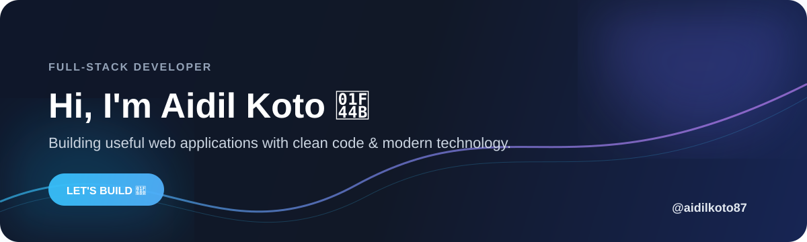

<div align="center">

<!-- ========================= HERO ========================= -->



<br/>

<a href="https://github.com/aidilkoto87">
  
</a>
<a href="mailto:aidilkoto45@gmail.com">
  
</a>

</div>

---

## 👋 Hello, I'm Aidil Koto

> **Full-Stack Developer** who enjoys turning ideas into useful, clean, and modern web applications.

I'm interested in **web development, backend systems, databases, geospatial applications, and software engineering**.  
Currently, I'm focused on improving my skills and building projects with **Laravel, PHP, JavaScript, MySQL, and modern web technologies**.

```text
💡 Build       →       🧩 Solve       →       🚀 Improve
```

---

## 🧑‍💻 About Me

<table>
<tr>
<td width="55%">

### What I do

- 🔭 Build web applications and information systems
- ⚙️ Work with Laravel & PHP
- 🗄️ Design and manage MySQL databases
- 🗺️ Explore geospatial web applications
- 📊 Build data import/conversion workflows
- 🎨 Create responsive and user-friendly interfaces
- 📚 Continuously learn new technologies

</td>
<td width="45%">

### Current Focus

```text
Backend Development   █████████████████░░░
Frontend Development  ████████████████░░░░
Database              █████████████████░░░
Geospatial             ██████████████░░░░░░
UI / UX                █████████████░░░░░░░
```

</td>
</tr>
</table>

---

## ⚡ Tech Stack

<div align="center">

### Languages

<a href="#"></a>

### Frameworks & Tools

<a href="#"></a>

</div>

---

## 🚀 What I'm Building

<table>
<tr>
<td width="50%">

### 📥 Excel → Database

A web-based workflow for importing and converting Excel data into a structured database.

**Stack**

`Laravel` `PHP` `MySQL` `JavaScript`

</td>
<td width="50%">

### 🗺️ Geospatial Transport

A web application concept for visualizing transportation data using interactive maps.

**Stack**

`Laravel` `Leaflet` `JavaScript` `MySQL`

</td>
</tr>

<tr>
<td width="50%">

### 💰 Payroll System

An information system for managing employee, attendance, and payroll-related data.

**Stack**

`Laravel` `PHP` `MySQL` `Bootstrap`

</td>
<td width="50%">

### 🌐 Portfolio

A personal portfolio for showcasing projects, skills, and development work.

**Stack**

`HTML` `CSS` `JavaScript`

</td>
</tr>
</table>

---

## 📊 GitHub Analytics

<div align="center">


<br/><br/>


</div>

---

## 📈 Contribution Graph

<div align="center">


</div>

---

## 🌐 Connect With Me

<div align="center">

<a href="mailto:aidilkoto45@gmail.com">
  
</a>

<a href="https://github.com/aidilkoto87">
  
</a>

<!-- Ganti URL di bawah dengan URL LinkedIn dan YouTube kamu -->
<a href="https://www.linkedin.com/">
  
</a>

<a href="https://www.youtube.com/">
  
</a>

</div>

---

<div align="center">

### 💭 "Keep learning. Keep building. Keep improving."

<br/>


<br/><br/>

**Thanks for visiting my profile! 🚀**

</div>
